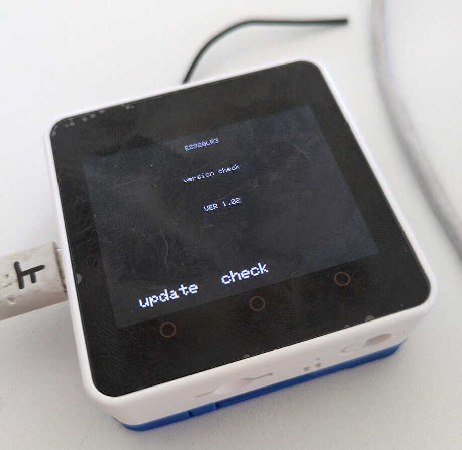

# M5Stack Core2 用 ES920LR3 ファームウェア更新プログラム

EASEL 社の 920MHz LoRa/FSK 無線モジュール（ES920LR3）の M5Stack 用開発基板のファームウェアを更新するためのプログラムです。



## 概要

このプロジェクトは、M5Stack Core2 を使用して ES920LR3 モジュールのファームウェアを更新するためのツールです。シリアル通信を介してファームウェアの書き込みとバージョン確認を行うことができます。

[元ネタ](https://ikkei.akiba.coocan.jp/ikkei_Electronics/M5LR3.html)のスケッチは M5Stack Basic をベースとしており、M5Stack Core2 でもファームウェアの更新自体は正常に実施できるものの、更新確認（バージョン表示）ができない状態でした。本プロジェクトは、M5Stack Core2 の画面表示機能を適切に利用できるよう、M5Unified ライブラリを使用して Core2 ベースにリファクタリングしたものです。

### ES920LR3 について

- **MCU**: STM32WLE5JC (ARM Cortex-M4)
- **メモリ**: FlashROM 256KB、RAM 64KB
- **消費電流**: 送信時 29mA、受信時 5.7mA、スリープ時 1.3μA
- **電源電圧**: 2.4 ～ 3.6V
- **技術基準適合認証（技適）**: 取得済み
- **規格**: ARIB STD-T108 準拠

## 機能

- **ファームウェア更新モード**: ES920LR3 をブートモードに切り替え、シリアル通信でファームウェアを書き込み
- **バージョン確認モード**: 現在のファームウェアバージョンを確認
- **シリアルブリッジ**: PC と ES920LR3 間のシリアル通信を中継

## ハードウェア接続

- **RX ピン**: GPIO 13
- **TX ピン**: GPIO 14
- **Boot ピン**: GPIO 22
- **Reset ピン**: GPIO 19

## 必要な環境

- PlatformIO
- M5Stack Core2
- ES920LR3 搭載 M5Stack 用開発基板

## ビルドとアップロード

```bash
# プロジェクトをビルド
pio run

# M5Stack Core2にアップロード
pio run --target upload

# シリアルモニタを開く
pio device monitor
```

## 使用方法

### 1. ファームウェア更新モード

プログラム起動時、自動的にファームウェア更新モードになります。

- 画面に「Firmware update」と表示されます
- PC のシリアルモニタ（115200 baud、8E1）からファームウェアデータを送信できます
- シリアル通信は自動的に ES920LR3 に転送されます

### 2. バージョン確認モード

- **ボタン B**を押すとバージョン確認モードに切り替わります
- 画面に「version check」と表示され、ファームウェアバージョンが表示されます
- **ボタン A**を押すとファームウェア更新モードに戻ります

### 3. シリアル通信の設定

- **更新モード**: 115200 baud、8E1（Even parity、1 stop bit）
- **通常モード**: 115200 baud、8N1（No parity、1 stop bit）

## プロジェクト構成

```
m5core2_firmware_updater/
├── platformio.ini          # PlatformIO設定ファイル
├── src/
│   └── main.cpp            # メインプログラム
├── include/                 # ヘッダーファイル
├── lib/                     # ライブラリ
└── test/                    # テストファイル
```

## 依存ライブラリ

- `m5stack/M5Unified@0.1.11`: M5Stack 統合ライブラリ

## 参考資料

- [M5Stack 用 LoRa 無線モジュール (ES920LR3) - 元ネタページ](https://ikkei.akiba.coocan.jp/ikkei_Electronics/M5LR3.html)
- [EASEL 社 ES920LR3 資料](https://ikkei.akiba.coocan.jp/ikkei_Electronics/M5LR3.html)

## ライセンス

MaiaR Create

## 注意事項

- ファームウェア更新中は電源を切らないでください
- DIP スイッチの設定を確認してください（デフォルトでは 1 と 2 を ON）
- アンテナは地面に対して垂直に伸ばすと通信距離が向上します
